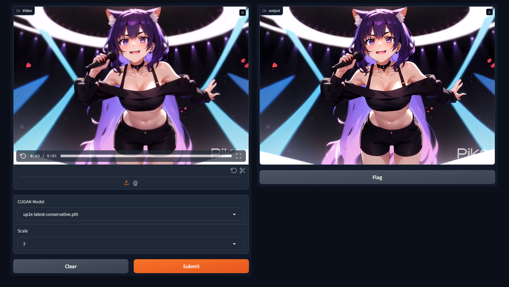
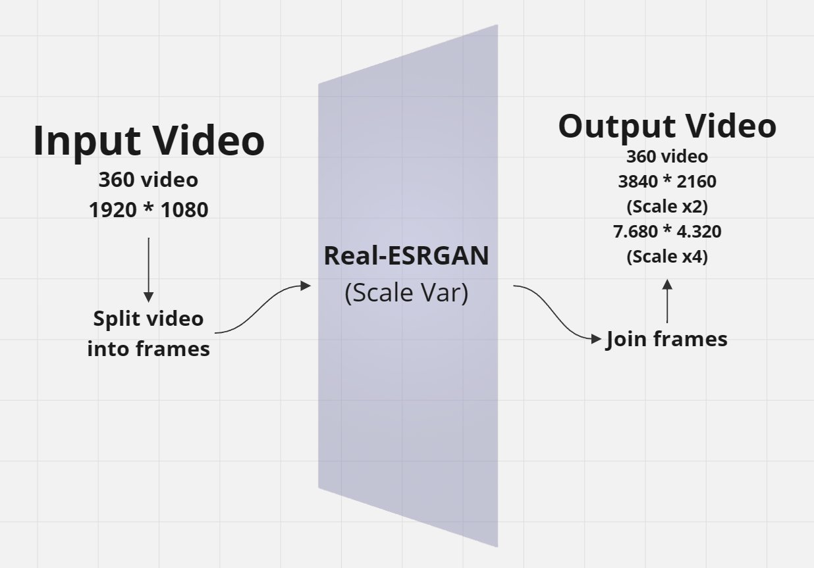
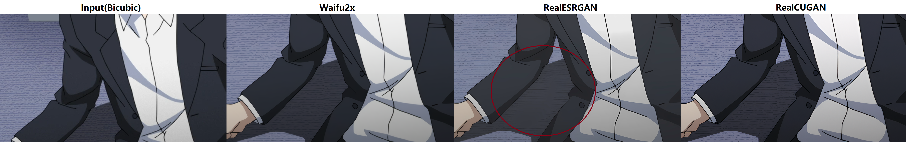

# 360-VIDEO-CUGAN-SCALED
CUGAN es un modelo de superresolución que utiliza la tecnología de redes generativas adversariales (GAN) para aumentar la resolución y la calidad de videos. Este repositorio específico implementa la capacidad de escalar videos de 360 grados

Claro, puedo ayudarte a crear ese documento. Aquí tienes un ejemplo de cómo podrías estructurarlo:

## Introducción

CUGAN (Conditional Upsampling GAN) es una inteligencia artificial diseñada específicamente para el escalado de videos, con un enfoque en mejorar la calidad de videos estilo anime y rescalando a resoluciones más altas como 360p. En este documento, se explicará el proceso de escalado utilizando CUGAN, se mostrará su arquitectura, un ejemplo de su funcionamiento y una comparativa con otros modelos.

## ¿Qué es CUGAN?

CUGAN es una red neuronal generativa adversarial (GAN) condicional que se entrena específicamente para el escalado de videos. Utiliza una combinación de arquitecturas GAN y técnicas de condicionamiento para generar imágenes de mayor resolución y calidad.

## Proceso de Escalado con CUGAN

El proceso de escalado con CUGAN se puede dividir en los siguientes pasos:

1. Preprocesamiento de datos: Preparación de los videos de entrada en el formato adecuado para el modelo.
2. Aplicación de CUGAN: Utilización de CUGAN para rescalar los videos a la resolución deseada (por ejemplo, 360p).
3. Postprocesamiento: Ajustes finales y optimización de la calidad de los videos escalados.

## Arquitectura de CUGAN

## Ejemplo de Escalado con CUGAN

A continuación, se muestra un ejemplo de escalado utilizando CUGAN:

## Comparativa con Otros Modelos

Se realizó una comparativa entre CUGAN y otros modelos de escalado de videos. Los resultados se muestran a continuación:

## Repositorio Original

El código fuente y más información sobre CUGAN se encuentra disponible en el siguiente repositorio: [Repositorio CUGAN](https://github.com/bilibili/ailab/tree/main/Real-CUGAN).
